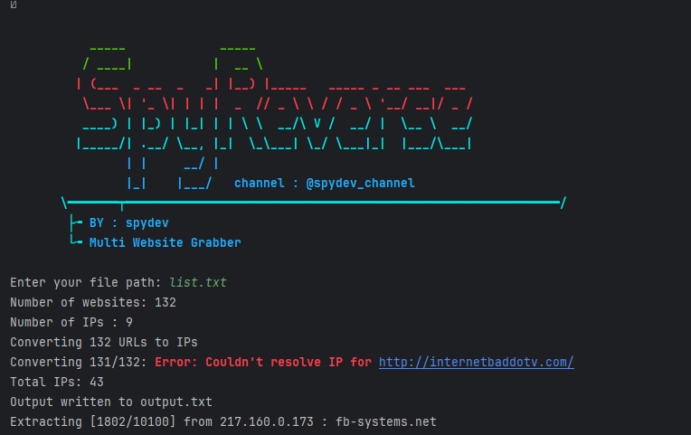

# # Mass Reverse IP


## What can it do?
This is mass website grabber 
the bot extract all websites from a list of IPs
the list you provide will be converted into IPs first then each ip will be processed and have websites extracted from it

---

## Requirements
* Python 3
* validators (see [Installation](#Installation))
* coloraama (see [Installation](#Installation))

---

## Installation
You can just install the dependencies using pip: `pip install -r requirements.txt`

If you want to manually install the required packages using your preferrec package manager, see [requirements.txt](requirements.txt) for a list of packages

---
**Linux**
```bash
git clone https://github.com/spydevofficial/Mass_Reverse_IP/
cd Mass_Reverse_IP
pip install validators
pip install colorama
python spyreverse.py
```
**Windows**
```
install python 3 ( add python to path )
pip install validators
pip install colorama
cd Mass_Reverse_IP
python spyreverse.py
```



## Issues & Features
If you find any problems or have a feature request, feel free to contact me.

Telegram : @spydev

Channel  : https://t.me/spydev_Channel
---
